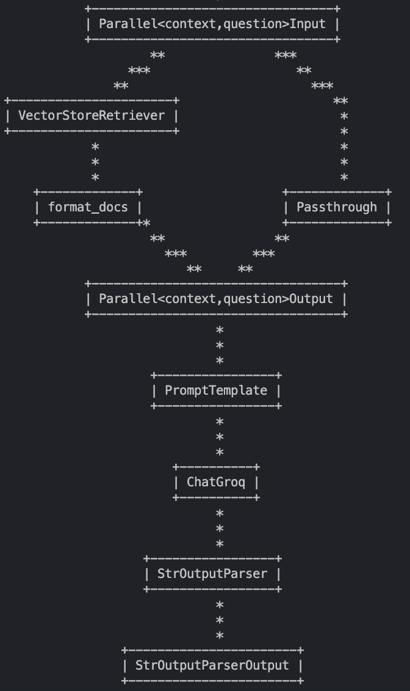
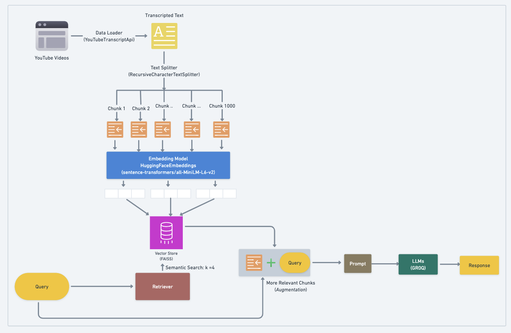

# 🎥 RAGTube – Chat with YouTube Videos

RAGTube is a **Retrieval-Augmented Generation (RAG) powered YouTube assistant** that lets you paste a YouTube video Url, fetch its transcript & metadata, and **ask natural language questions directly from the video content**.  

No more scrubbing through long videos — just **query, retrieve, and get instant answers**. 🚀  


## ✨ Features
- 🔗 Paste a **YouTube Video URL** and fetch details & transcript  
- 📑 **Chunk & embed transcripts** using LangChain  
- 📂 Store embeddings in **Vector DB** (FAISS)  
- 💬 Ask **natural language questions** from the video  
- 🤖 Powered by **LLMs (GROQ.)** for intelligent answers  
- 🎨 Simple **UI with Streamlit ** for interaction  


## 🛠️ Tech Stack
- **LangChain** – Retrieval & orchestration  
- **OpenAI / LLaMA** – LLM for Q&A  
- **FAISS / Pinecone** – Vector database for embeddings  
- **YouTube API / pytube / youtube-transcript-api** – For video details & transcript  
- **Streamlit / Gradio** – User interface  


## 🚀 Installation

1. Clone the repository:
   ```bash
   git clone https://github.com/Aadarsh4u-code/RAGTube
   cd ragtube
   ```

2. Create & activate a virtual environment:
   ```bash
   python -m venv venv
   source venv/bin/activate   # On Mac/Linux
   venv\Scripts\activate      # On Windows
   ```

3. Install dependencies:
   ```bash
   pip install -r requirements.txt
   ```

4. Set up your environment variables in `.env`:
   ```ini
   OPENAI_API_KEY=your_openai_key
   YOUTUBE_API_KEY=your_youtube_key
   ```


## ▶️ Usage

### Run with Streamlit:
```bash
streamlit run app.py
```

### Example Workflow:
1. Paste a YouTube video url 👉 `https://www.youtube.com/watch?v=T-D1OfcDW1M`  
2. Click **Fetch Transcript**  
3. Ask:  
   - *“Summarize the video in 5 bullet points”*  
   - *“What did the speaker say about X at 10:30?”*  
   - *“List the main steps mentioned in the tutorial.”*  


## 📸 Screenshots (Optional)




## 📊 Example Use Cases
- 🎓 *Study lectures without watching the full video*  
- 📊 *Summarize financial / technical discussions*  
- 🎬 *Chat with podcasts, reviews, or tutorials*  
- 📖 *Extract quotes and highlights instantly*  


## 🤝 Contributing
Contributions, issues, and feature requests are welcome!  
Feel free to open a PR or issue.


## 📜 License
This project is licensed under the MIT License.  


## 💡 Future Enhancements
- Support for **multi-video Q&A**  
- Add **summarization by chapter**  
- Integration with **Whisper API** for speech-to-text when transcripts are unavailable  
- Deploy as a **web app** (HuggingFace / Vercel / AWS)  


### ⭐ If you like this project, consider giving it a star on GitHub!
